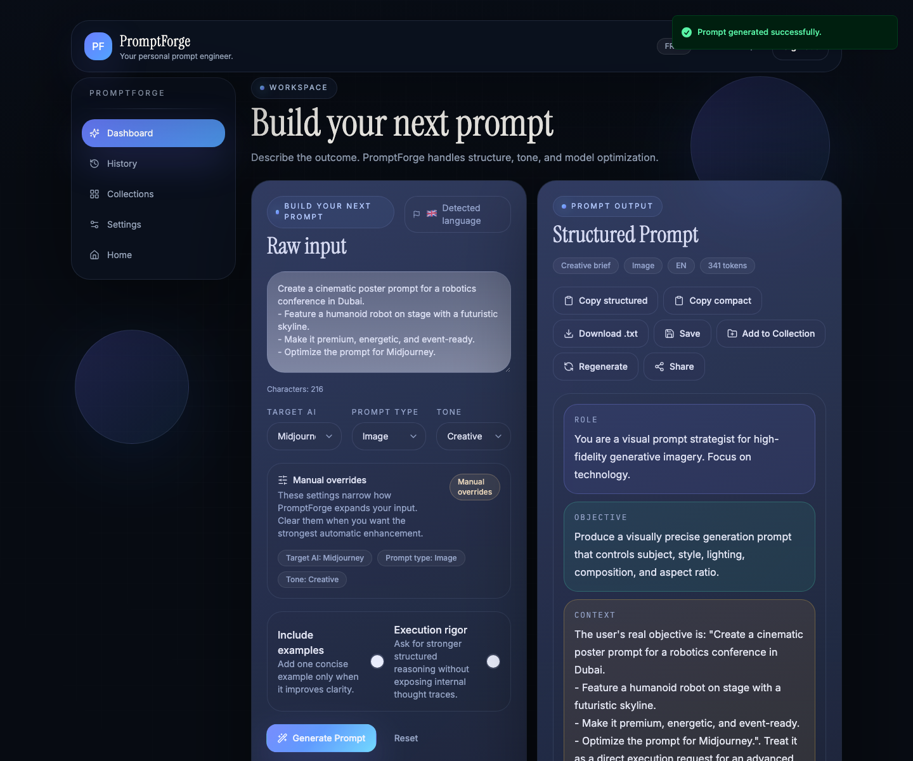
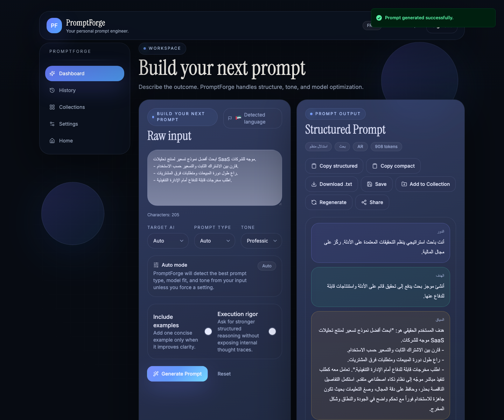

# PromptForge

**A bilingual English/Arabic prompt application built with React and TypeScript.**

PromptForge turns rough ideas into structured, model-aware prompts. It combines a
deterministic prompt builder with Mistral-backed enhancement, saved history,
collections, authentication, and usage quotas.

Start with [the engineering reviewer guide](docs/REVIEWER_GUIDE.md) and the
[dated validation record](docs/VALIDATION_2026-09-09.md). This is a
portfolio/development project, not a claim of production readiness.

## See it working

Actual Chromium captures from the isolated English/Arabic browser tests, using
synthetic input and a test account. Prompt generation here uses the deterministic
builder; these are not screenshots of a paid model integration.

| English input and structured output | Arabic input and structured output |
| --- | --- |
|  |  |

## What to inspect

| Component | Implementation | Evidence |
| --- | --- | --- |
| Prompt construction | Backend `promptBuilder.ts` | Unit tests and 12 English/Arabic structural regression seeds |
| Model-output handling | Backend `aiService.ts` | Mocked generation, quality-check, and repair tests |
| Account boundaries | Controllers, Zod schemas, `userSerializer.ts` | Route tests and exclusion of password hashes from responses |
| Interface | React, Vite, Zustand, i18next, Tailwind | 30 component/hook tests; real Chromium checks for English and Arabic |
| Async interactions | Frontend `uiAction.ts` | Success, rejected promise, synchronous failure, and fallback tests |
| Storage | Prisma/PostgreSQL and Redis | Fresh real database migrations and browser-created records; unit/API tests also use doubles |

## Architecture

```text
React UI -> Express API -> deterministic PromptBuilder -> Mistral API
                       -> PostgreSQL (Prisma): users, prompts, collections
                       -> Redis: quotas and refresh-session cache
```

The UI uses cookies and a CSRF header. Zod validates request bodies. Tests do not
establish that every security control is complete.

## Reproduce local checks

Tested on macOS arm64 with **Node 26.5.1 and npm 11.17.0**, September 9, 2026.
These checks need no personal credentials, live database, Redis, or paid model
call. Package installation requires network access; Prisma may download an engine.

From the repository root:

```bash
cd apps/backend
npm ci --ignore-scripts
npm run prisma:generate
npm run lint
npm run typecheck
npm test
npm run build
npm run test:regression
cd ../frontend
npm ci --ignore-scripts
npm run lint
npm run typecheck
npm test
npm run build
```

Observed locally: **25 backend tests, 30 frontend tests, and 12 regression seeds
passed**, with no flagged regression metrics. These are different checks, not
67 independent end-to-end scenarios. Backend integration tests exercise HTTP
routes with mocked database/Redis/provider boundaries. Frontend tests use jsdom,
not a deployed browser. The test launcher handles the Node 26/Vitest Web Storage
interaction without removing storage assertions.

Separately, **two real-browser suites passed across 12 English/Arabic scenarios**
against an isolated PostgreSQL 16.13 database and Redis 8.6.2. Migrations applied;
one synthetic user and 12 prompt records persisted. A loopback provider sentinel
recorded **zero model-provider requests**. These checks cover the deterministic
generation path, not every interactive feature or external model output quality.

The [CI workflow](.github/workflows/ci.yml) documents a service-backed setup and
runs the same suites with PostgreSQL 16 and Redis 7. **That Linux/service-version
combination remains unverified for this candidate until its hosted run passes.**
Do not run destructive setup or test accounts against an existing personal or
production database. See the validation record for scope and reproduction details.

## Running the application: configuration boundaries

Docker Compose and development scripts are included. **Container deployment was
not validated in this maintenance review.** Review configuration before use.

- Never commit real `.env` files. Required settings are listed in `.env.example`.
- Backend dotenv reads its working directory. Compose passes the root `.env`;
  npm started inside `apps/backend` does not automatically read that root file.
- `.env.example` uses `HOST=127.0.0.1` for local development. The default remains
  `0.0.0.0` for compatibility, and Compose explicitly sets it for container routing.
- `NODE_ENV=test` deliberately disables server startup. Use `development` for
  the local HTTP browser-test backend; CI sets this on its startup step only.
- Compose keeps PostgreSQL/Redis internal. Starting those two containers does not
  expose them to a host-side backend. Configure separate host services or use the
  full container network.
- Compose maps UI port 8080; Vite uses 5173 and preview 4173 by default. Align API
  URL, CORS, origin, TLS, and cookie settings for the chosen environment.
- Production-style cookies require deployment-specific review. The HTTP localhost
  Compose example is not evidence of working production login.
- Actual Mistral calls need a valid key and may incur charges. Automated checks
  above do not require one.

## Security and maintenance status

The September update fixes user serialization: explicit public-field allowlists
replace returning full ORM records containing `passwordHash`. Regression
assertions cover register, login, refresh, current-user, and profile updates.

The September 9 clean installs and full dependency audits returned **zero reported
advisories in both packages**. Playwright is pinned to 1.60.0; Vitest and its
coverage package to 4.1.11. Scoped transitive overrides resolve the deepmerge-ts
and esbuild findings while retaining Prisma 6; see the reviewer guide for the
compatibility checks and maintenance caveat. A clean audit is not proof of security.

**Not established:** updated hosted CI for this candidate, paid provider
integration, Docker builds, or deployment readiness.
Existing Dockerfiles target Node 20 and need a tested runtime refresh before
deployment. CI targets the locally tested Node version. Deployment is now manual
(`workflow_dispatch`), so a portfolio update does not automatically publish
containers or connect to a server.

## Development approach

Maintenance was prepared with Codex assistance: reproduce a failure, add an
assertion, make a correction, and rerun checks. The code is not presented as
entirely unaided work.

Existing [outcome evaluation](docs/outcome-eval-harness.md) and
[v1.1 roadmap](docs/v1.1-roadmap.md) documents describe plans/context, not proof of
every feature's delivery. No new software license is selected by this update.
